# 📚 Library Management System

A Qt-based Library Management System for students and administrators was made as non-mandatory project for the OOP course,ENSIA. In 15 extensive days of hardworking and learning  
The system allows students to interact with library resources and provides admins with tools to manage resources, users, and library operations.Everybody can work and contribute to enhance it 
in the future.
It was such an opportunity to see how projects are built and how they are well-structured.
---

## 🎯 Project Overview

This project is built using **C++ and Qt Widgets**. It features a modern graphical interface for two user roles:

- **Student Interface**
- **Admin Interface**

It uses **JSON** files for persistent data storage.

---

## 👩‍🎓 Student Interface Features

Students can:

- 🔍 **Search and view book/resource details**  
  View author, subject, publication date, and more.

- 📖 **Borrow available books**  
  If a book is available, students can borrow it.

- 📋 **Reserve unavailable books**  
  When a book is currently loaned, students can reserve it.

- 📤 **Return borrowed books**  
  Once finished, students can return their borrowed books.

- 🔔 **Receive notifications**  
  View due dates, reservation alerts, and other library notifications.

- 📊 **View loan statistics**  
  See total books borrowed, active loans, and historical stats.

---

## 👨‍💼 Admin Interface Features

Admins can:

- ➕ **Add new users**  
  Register new students to the system.

- 📚 **Add and manage resources**  
  Add books, digital content, theses, and articles.

- 👀 **View and manage all loans and reservations**  
  Track all current and historical borrow/return records.

- 📊 **Access Dashboard with statistics**  
  Visual charts and numbers showing:
  - Total resources per category
  - Most borrowed resources
  - Loan and reservation trends

- 🛠️ **Full system control**  
  Admins can modify or remove users/resources as needed.

---

## 🛠️ Technologies Used

- **C++**
- **Qt 5/6 (Qt Widgets)**
- **JSON** (for storing users, resources, and transactions)
- **Qt Charts** (for admin statistics dashboard)

## Lessons Learned

- Yhe main lesson or takeaway I got from this experince is Good planning, because it saves a lot of time, mainly in the design.-  

## 📦 Installation Guide

### Prerequisites
- Qt 5.15 or later installed
- Qt Creator (optional but recommended)

### Steps
```bash
git clone https://github.com/ghazalimegh1/Library-Management-System.git
cd Library-Management-System
```
- Open the .pro file using Qt Creator
- Build the project in Release mode
- Click Run
### Screenshots
<h3>🔐 Login Interface</h3>
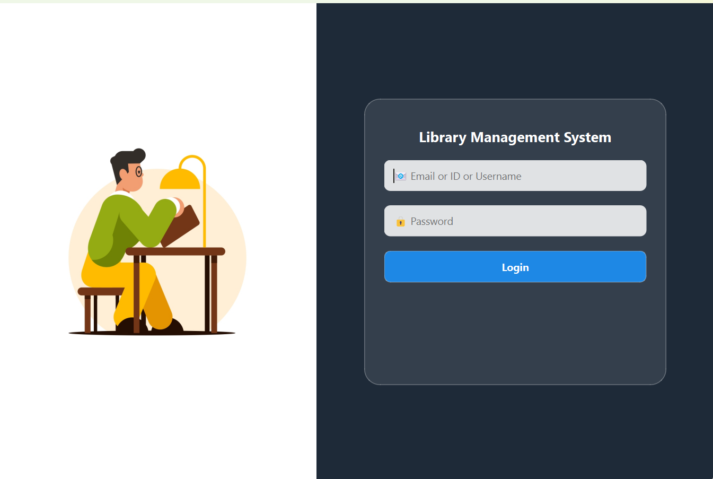

<h3>🎓 Student Dashboard</h3>
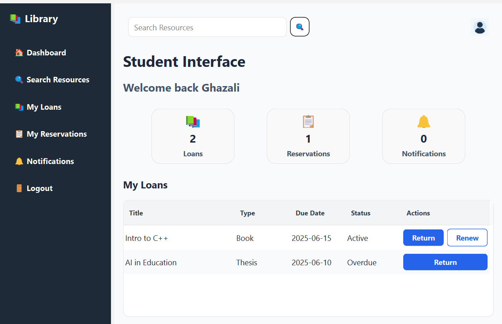

<h3>🔍 Student – Search Resources</h3>
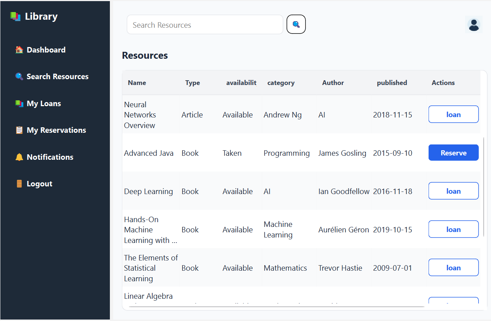

<h3>📚 Student – Loans</h3>
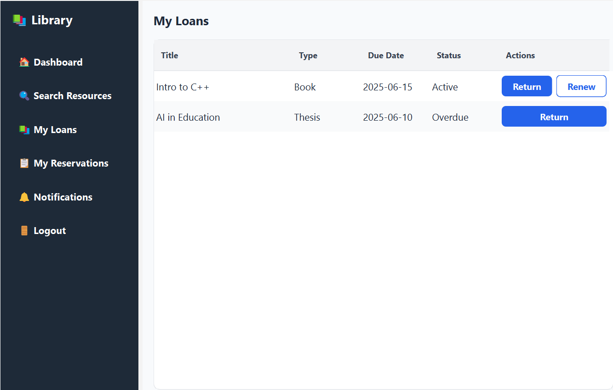

<h3>📋 Student – Reservations</h3>
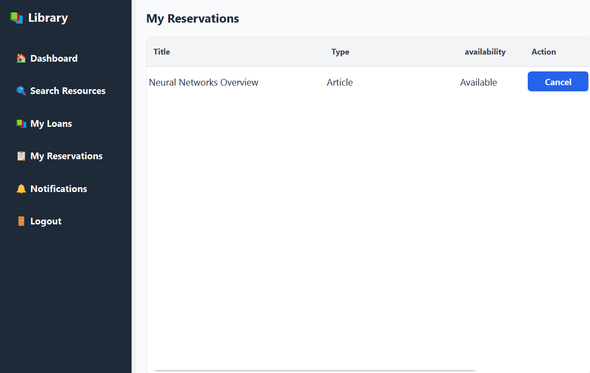

<h3>🔔 Student – Notifications</h3>
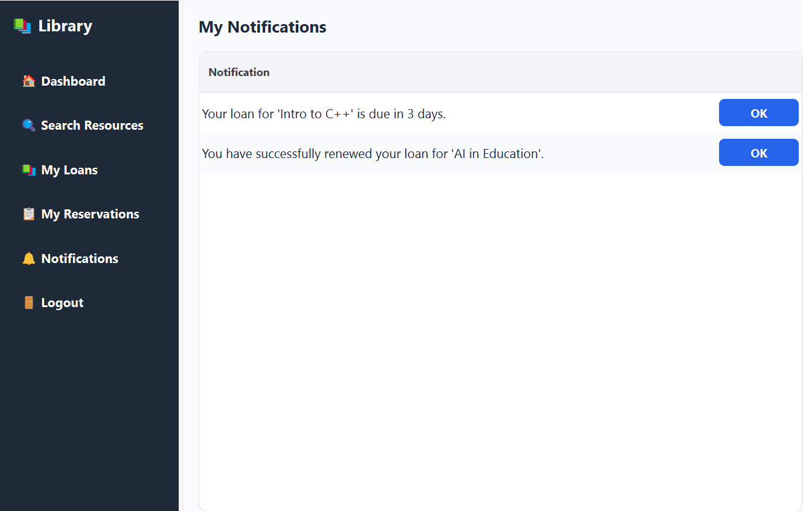

<h3>🛠️ Admin Dashboard</h3>
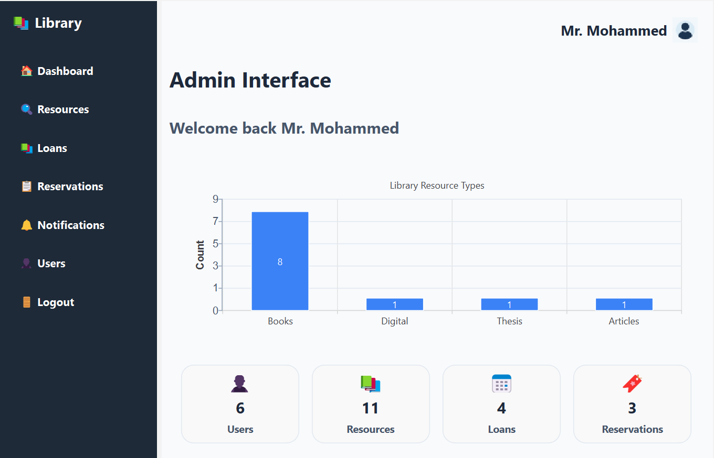

<h3>📖 Admin – Resources</h3>
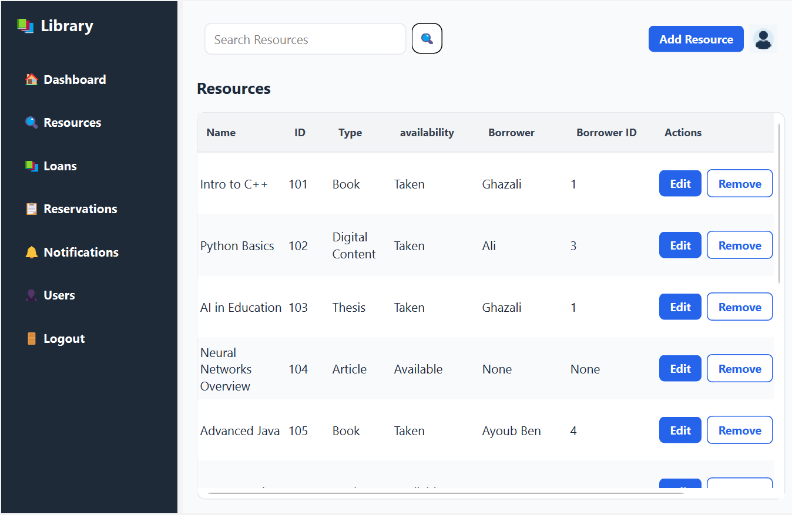

<h3>📑 Admin – Loans</h3>
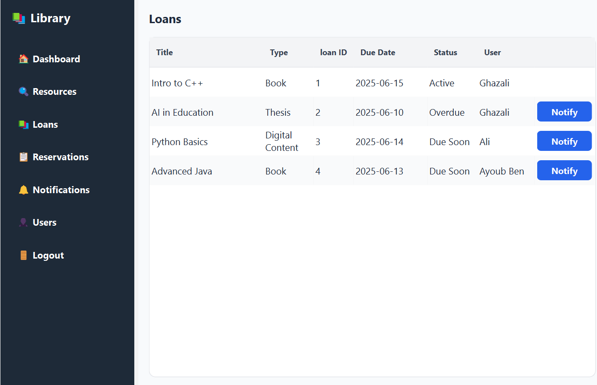

<h3>📅 Admin – Reservations</h3>
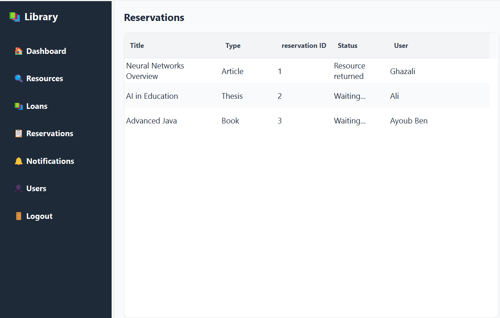

<h3>👤 Admin – User Management</h3>
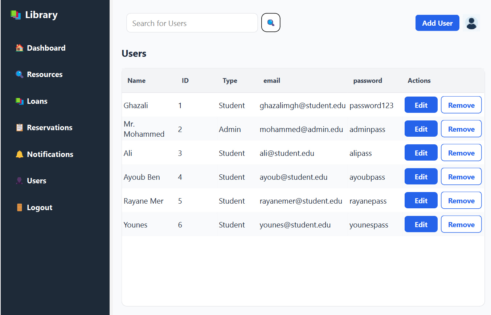


